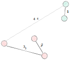

# Objects linkage hierarchical clustering

These algorithms simply fuse objects into clusters according to certain
distance treshold. There is 3 variants, single, complete and
intermediate linkage

## Single linkage

This is the oldest method and simpler method. 
Connect objects/clusters based on smallest distance. 
Also known as the **Nearest point algorithm**.

**Calculation**:

Two clusters fuse when the two closest objects are at a distance $\leq$ 
than the distance level of the current partition. Formaly, this is defined as:

$$d(u, v) = min(dist(u_{i}, v_{j}))$$

Here the two rightmost objects are first fuse in the green cluster. 
Then, the leftmost nodes are fused, in step 2 and 3, in red cluster. 
The two cluster will lastly be fused on step 4.

**PRO**
- Fast ans easy to implement
- May be suitable for elongated/chained structure

**CON**
- Sensitive to noise in data  as outlier may be the points on which fusion depends at a given step.

**ORIGIN**
Collective work by mathematicians Florek, Lukaszewicz, Perkal, Steinhaus, and Zubrzycki, published in 1951[^ref1]

## Complete linkage
Opposite to the single linkage algorithm, the fusion depends on the most distant pairs of objects. 
Also called **furthest neighbour sorting** or **Farthest Point Algorithm**.

**Calculation**
Fuse two clusters if the maximum distance between pairwise points 
is $\leq$ that the distance level of the current partition.

$$d(u, v) = max(dist(u_{i}, v_{j}))$$

On step 1 and 2, objects are fused into green and red cluster respectively. 
On step 3, the leftmost object is fused with the red cluster using the pairwise distance with the furthest object. 
Step 4 fuse both the red and green cluster based on maxixum pairwise distance.

**PROS**
- Tends to produces clusters with clear discontinuities

**CONS**
- As cluster grows, it become more difficult to add new objects to the cluster.

**Shape**
- In comparison, complete linkage tends to produce spherical clusters, while single linkage tends to producs elongated clusters.

From Legendre (2012) p. 351 [^ref2]:

> According to Lance & Williams (1967c), this is equivalent to dilating the reference space in the neighbourhood of that cluster \[...\] 
> This effect is opposite to what was found in single linkage clustering, which contracted the reference space. 
> In \[descriptor space\], complete linkage produces maximally linked and rather spherical clusters, 
> whereas single linkage may produce elongated clusters with loose chaining.

## Intermediate linkage

In between single and complete linkage. The fusion criterion is satisfied when a given proportion of the total possible number 
of links is reached. For example, for a criterion of 50%, a fusion happened when their is 
50% of the maximum links (i.e., distance between objects at a current partition level).

Never used it personnaly...

[^ref1]: Florek, K., et al. "Sur la liaison et la division des points d'un ensemble fini." Colloquium Mathematicum 2.3-4 (1951): 282-285. [http://eudml.org/doc/209969](http://eudml.org/doc/209969)
[^ref2]: Legendre, P., & Legendre, L. (2012). Numerical ecology (3rd ed., Vol. 24). Elsevier.

