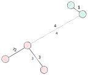

# Single-linkage clustering

#clustering #method

This is the oldest method and simpler method.
Connect objects/clusters based on smallest distance.
Also known as the **Nearest point algorithm**.

**Calculation**:

Two clusters fuse when the two closest objects are at a distance $\leq$
than the distance level of the current partition. Formaly, this is defined as:

$$d(u, v) = min(dist(u_{i}, v_{j}))$$

Here the two rightmost objects are first fuse in the green cluster.
Then, the leftmost nodes are fused, in step 2 and 3, in red cluster.
The two cluster will lastly be fused on step 4.

**PRO**
- Fast ans easy to implement
- May be suitable for elongated/chained structure

**CON**
- Sensitive to noise in data  as outlier may be the points on which fusion depends at a given step.

**ORIGIN**
Collective work by mathematicians Florek, Lukaszewicz, Perkal, Steinhaus, and Zubrzycki, published in 1951[^ref1]

[^ref1]: Florek, K., et al. "Sur la liaison et la division des points d'un ensemble fini." Colloquium Mathematicum 2.3-4 (1951): 282-285. [http://eudml.org/doc/209969](http://eudml.org/doc/209969)
